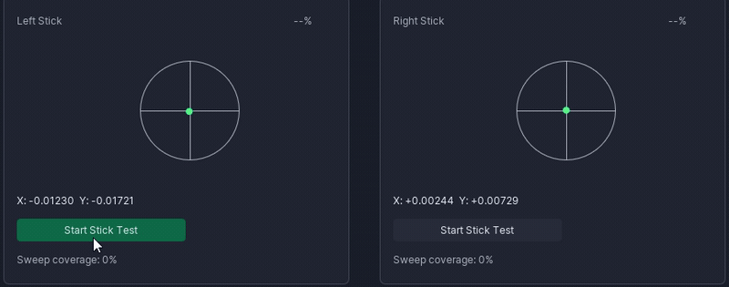

# LegendCTL

*Unofficial Windows configurator for ZD Ultimate Legend controllers.*

[](https://github.com/EvilHumphrey/LegendCTL/releases/latest)
[](LICENSE)
[](https://github.com/EvilHumphrey/LegendCTL/actions/workflows/ci.yml)


LegendCTL is a free, open-source Windows app for reading and applying ZD Ultimate
Legend controller settings. It runs **standalone** — it talks directly to the
controller over USB-HID, so the official ZD app is **not required** to use it (and
it coexists cleanly with the official app if you keep that installed). It is
lightweight, fully local, and preserves your configuration across sessions. It
configures the controller's supported settings — it is not a firmware updater.

> **Independent third-party project. Not developed by, affiliated with, or
> endorsed by ZD Gaming.** "ZD Gaming" and "ZD Ultimate Legend" are used only
> to identify the controller this tool is compatible with; all trademarks are
> the property of their respective owners.

[**⬇ Download the latest release**](https://github.com/EvilHumphrey/LegendCTL/releases/latest) — Windows 10/11, portable ZIP or installer.

> **First launch shows a SmartScreen prompt — that's expected.** Because the
> build is currently unsigned, Windows may show "Windows protected your PC" the
> first time you run it. That's normal for any new unsigned app, not a malware
> warning — choose **More info → Run anyway**. You can
> [verify the download's SHA-256](#distribution-safety) first if you like.

## Why LegendCTL?

Whether or not you use the official ZD app, here's what this one gives you. The
short version is **trust you can verify**:

- **Open source, MIT-licensed.** Every line is on GitHub — read it, build it
  yourself, fork it. Nothing is hidden.
- **Fully local — no network, no telemetry.** The LegendCTL process makes
  **zero** network calls — no telemetry, no analytics, no auto-update. (The one
  outbound action is the About screen's GitHub links, which hand a URL to your
  browser; the app itself opens no socket.) Closed controller and peripheral
  software often phones home and bundles analytics SDKs; this one doesn't — and
  you don't have to take that on faith. You can
  [confirm the no-network behavior yourself](docs/verifying-no-network.md) in a
  couple of minutes.
- **No drivers, no virtual devices, no background service.** Nothing installs a
  driver or sits running in the background. Close the app and nothing of it is
  left behind.
- **Honest write reporting — no fake success.** A normal Apply reports each
  field's real write outcome and refreshes the on-screen state from the device;
  the Restore, Safe Import, and inline deadzone flows go further and verify by
  reading the value back — so a write that didn't take is surfaced honestly
  instead of flashing "success."
- **No macros, turbo, or automation.** It configures your controller; it never
  plays for you. That's a deliberate constraint enforced by tests, not a missing
  feature.
- **A safety net by default.** Device-touching changes — applying device
  settings, deadzone tuning — capture a **Restore Point** first, wrapper events
  are written to an append-only local ledger, and there is always a
  [Recovery](#recovery--if-your-controller-feels-off) path back.

That's the whole pitch: a small, auditable, no-surprises tool for your controller
— open where closed software is opaque, local by design, and honest about what it
can and can't do.

## Demo



**Live Verify** reads both sticks straight from XInput. Start a stick test and sweep — each stick's trace fills its circle, sweep-coverage climbs, and the per-stick circularity settles to a percentage, so you can see how round your sticks really are and catch a flat spot or off-center rest. Everything runs locally; no network, no telemetry.

## Status

v2.0.1 — feature-complete for normal use.

Controller settings (all written as standard HID feature reports; a normal Apply
reports each field's write outcome and refreshes the on-screen state from the
device, while the Restore, Safe Import, and inline deadzone flows read back and
verify the written value — the write-only back-paddle bindings are reported as
sent, not verified):

- USB polling rate (250–8000 Hz; 8K requires firmware v1.18+)
- 16×16 button binding matrix
- Sticks: deadzone (4 zones), sensitivity curves (3-anchor, plus 8-point curves on
  firmware v1.24+), axis inversion, joystick step-size
- Triggers: range, mode, vibration mode
- Lighting: per-zone (Home / Left / Right) — on/off, mode, brightness, RGB
- Vibration: per-motor + trigger vibration mode
- Back-paddle bindings: 1-step controller-button-only (8 paddles: M1–M4, LM, RM, LK, RK)
- Wrapper profiles: save / apply / delete with full controller state

Controller lifecycle & trust surfaces:

- Restore Points: full-state capture before risky operations, per-entry verified
  restore, retention pruning
- Device vs Profile: read-only three-way diff (live device / saved profile /
  last-applied) with per-field drift highlighting
- Health Report (guided multi-step measurement workflow, exportable) and Readiness
  Check (20-second pre-match verdict)
- Wear Ledger: append-only audit log of wrapper events
- Module Passport: per-side stick-module fingerprints with longitudinal trends
- Diagnostic Bundle: operator-triggered, path-sanitized shareable evidence export
- Trust card at first connect; English + Simplified Chinese UI throughout
- Live Verify: live XInput stick + per-stick circularity readout, plus inline
  firmware-deadzone tuning — each deadzone write is read-back-verified and captures
  a Restore Point first

Deliberately absent (constraint architecture, enforced by tests): no drivers, no
virtual devices, no input injection, no macros/turbo/automation, no background
service, no network calls, no telemetry, no auto-update. See
[docs/ARCHITECTURE.md](docs/ARCHITECTURE.md). You can confirm the no-network
behavior yourself in a couple of minutes — see
[docs/verifying-no-network.md](docs/verifying-no-network.md).

Profile sharing ("Safe Import") exists in the codebase but is dev-gated and parked —
the Import button is hidden unless the Developer toggle is enabled.

## Disclaimer & risk

ZD Gaming asked that this project carry the following disclaimer, which it
reproduces verbatim:

> This software is not developed or endorsed by ZD Gaming. Use at your own risk, and any controller issue caused by using this tool is not covered under the official warranty.

Beyond that: LegendCTL is provided **"as is", without warranty of any kind**,
express or implied, to the maximum extent permitted by applicable law. You
assume all risk arising from its use. It writes settings to controller hardware
over USB/HID and reports each field's write outcome; the Restore, Safe Import,
and inline deadzone flows additionally verify by read-back, and the write-only
back-paddle bindings are reported as sent. There is always a **Recovery** path
(see below), but you are responsible for how you use it.

See [SECURITY.md](SECURITY.md) for the security posture,
[docs/verifying-no-network.md](docs/verifying-no-network.md) to confirm the
"no network" claim yourself, [NOTICE](NOTICE) for affiliation and third-party
license details, and the [code-signing policy](docs/code-signing-policy.md) for
how releases are (will be) signed.

## Download

Two ways to get it — the **portable ZIP is the simplest** and needs no admin
rights; the installer adds Start-Menu/uninstaller integration if you prefer it.
Both ship the exact same wrapper executable. (In the download names below,
`<version>` is just the release number — e.g. `2.0.1` in the current release.)

> **A note on names.** The project is named **LegendCTL**, but the application
> window, Start Menu entry, and executable still carry the legacy name *ZD
> Ultimate Legend Wrapper* / `ZD Ultimate Legend.exe` — it is the same program,
> and the download files below keep those legacy names too.

### Portable ZIP (recommended)

Download `ZDUltimateLegend-v<version>-windows.zip` from the [latest release](https://github.com/EvilHumphrey/LegendCTL/releases/latest).

Extract anywhere and run `ZD Ultimate Legend.exe` — no admin, no UAC prompt, no
installer, and you uninstall by deleting the folder. Settings persist in
`%APPDATA%\ZDUltimateLegend\` regardless of where the wrapper folder lives. This
is the low-friction way to try it: run it from anywhere, including a thumb drive,
even without admin rights.

### Installer

Download `ZDUltimateLegend-v<version>-Setup.exe` from the [latest release](https://github.com/EvilHumphrey/LegendCTL/releases/latest).

The installer:
- Installs to `%ProgramFiles%\ZDUltimateLegend\` (requires admin — you'll see a UAC prompt). Installing under Program Files means only administrators can modify the app files, which prevents tampering / DLL planting.
- Adds a Start Menu entry under "ZD Ultimate Legend Wrapper".
- Registers an uninstaller in Windows Settings → Apps.
- Optionally adds a desktop shortcut (unchecked by default).

The only difference between the two is the surrounding install/uninstall
machinery; the wrapper itself is identical.

### Distribution safety

Releases will be code-signed through the [SignPath Foundation](https://signpath.org)
free certificate program for open-source projects — see the
[code-signing policy](docs/code-signing-policy.md). Until that is in place, the
released executable is **unsigned** (no Authenticode code-signing certificate),
so a couple of things are expected and normal:

- **SmartScreen warning.** The first time you run it, Windows SmartScreen will
  likely show a "Windows protected your PC" / "unrecognized app" prompt. That
  is what Windows shows for any unsigned app — it is not in itself a sign of
  malware. If you trust the source and have verified the hash (below), choose
  **More info → Run anyway**.
- **Verify the published SHA-256.** Every release publishes `SHA256SUMS.txt`,
  which lists the hash of each downloadable artifact (the `-windows.zip` and the
  `-Setup.exe`). Confirm your download matches before extracting/running:

  ```powershell
  Get-FileHash ".\ZDUltimateLegend-v<version>-windows.zip" -Algorithm SHA256
  ```

  Compare the output against the matching value in `SHA256SUMS.txt`.
- **Antivirus false positives.** PyInstaller-packaged apps (this is one) are a
  well-known source of heuristic antivirus false-positives, because the
  self-extracting bundle pattern resembles some packers. If your AV flags the
  build, you can upload it to [virustotal.com](https://www.virustotal.com/) to
  cross-check it against many engines.

## Quick start (released build)

1. Plug a ZD Ultimate Legend controller into a USB port.
2. Launch `ZD Ultimate Legend.exe` (from the Start Menu shortcut after an
   installer install, or by extracting the portable ZIP and double-clicking).
   **On first launch,** because the build is currently unsigned, Windows
   SmartScreen may show "Windows protected your PC." That's normal for any new
   unsigned app and not a sign of malware — click **More info → Run anyway**
   (you can [verify the download's SHA-256](#distribution-safety) first if you
   like).
3. The app auto-reads current controller state on connect.
4. Adjust settings via the sidebar tabs; click Apply per-tab or in the footer to write.

## Will it work on my controller?

**If you have a ZD Ultimate Legend, the core settings very likely work.** The app
was developed and bench-tested on a **single ZD Ultimate Legend unit**, on the
firmware it ran — **known-working firmware: v1.18 (including 8K polling) and v1.24
(including the 8-point sensitivity curves).**

The ZD Ultimate Legend ships in **six controller variants** with different stick
modules and firmware revisions. Other firmware versions, the other variants, and
different stick modules are **best-effort**: the HID protocol this app relies on
may differ, so some settings may read or write differently — or not at all — on
hardware that wasn't on the bench. The important part is that the app is built to
**report unsupported or unverified paths explicitly rather than pretend a write
succeeded** — and there is always the [Recovery](#recovery--if-your-controller-feels-off)
path if something looks off. If a setting misbehaves on your unit, please
[report it](SUPPORT.md) with the requested signature data and logs.

## Recovery — if your controller feels off

If the controller starts behaving oddly after changing settings (whether with
this tool or any other), there is always a clear way back:

1. **Official ZD app → "Restore to default".** Open the official ZD Gaming app,
   use its *Restore to default* function, then re-apply your preferred settings.
   This is the vendor's own known-good reset and the most reliable recovery
   path.
2. **Wrapper Restore Points.** Before risky operations this app captures a
   Restore Point — a snapshot of the app-readable settings. Open **Restore
   Points** in the sidebar and restore an earlier one to roll back the settings
   this app can write. Restore Points cover app-supported, app-readable settings
   (they are not a full firmware/factory backup); each point states exactly what
   it captured.

Between the vendor's "Restore to default" and the wrapper's Restore Points, you
always have an undo.

## Getting help

Start with the **[FAQ](docs/FAQ.md)** — it answers the common questions (is it
safe? do I need the official app? why the SmartScreen warning? does it phone
home? will it work on my controller?).

Bug reports and questions are welcome through GitHub. Please read
[SUPPORT.md](SUPPORT.md) first — it explains what belongs in an **Issue** (a
reproducible bug, filed with the data the bug-report form asks for) versus a
**Discussion** (questions and general help), and what this best-effort hobby
project can and cannot support. There is no private DM or email support
channel; reports for untested hardware need the requested signature data and
logs attached or they will be closed.

## Build from source

Requires **64-bit Python 3.12** (the version this build is developed and tested
against). The pinned `dearpygui==2.3` ships prebuilt wheels only for specific
Python versions and architectures, so other interpreters may need to compile it
from source.

```powershell
python -m venv .venv-zd
.venv-zd\Scripts\pip install -r requirements.txt
.venv-zd\Scripts\pythonw main_zd.py
```

`pythonw` (no console window) is preferred over `python` for normal use. If the
window doesn't appear, re-run with `python` (not `pythonw`) to see startup errors
in the console.

## Build a release

```powershell
.\tools\build_release.ps1
.\tools\smoke_release.ps1 -DurationSeconds 5
```

Output: `dist/ZDUltimateLegend-v<version>/ZD Ultimate Legend.exe` plus a
windows zip ready for distribution. If [Inno Setup 6](https://jrsoftware.org/isdl.php)
is installed (`C:\Program Files (x86)\Inno Setup 6\ISCC.exe`), an installer
`.exe` is also produced. The build script falls back gracefully when Inno
isn't installed — only the ZIP is produced in that case.

## Run the test suite

```powershell
.venv-zd\Scripts\python -m unittest discover tests -p "test_*.py"
```

## Architecture

Full technical architecture: [docs/ARCHITECTURE.md](docs/ARCHITECTURE.md). Short map:

- `zd_app/protocol/` — stable HID protocol layer (interface enumeration, two-handle
  session helpers, preflight checks). Production code; shipped in the dist.
- `zd_app/services/` — business logic, zero UI imports: settings transport + apply
  coordinator (write-then-verify with firmware-quirk trailers), restore points,
  snapshot differ, health report, wear ledger, module passport, diagnostic bundle.
- `zd_app/storage/` — JSON/JSONL stores with atomic writes: wrapper profiles, app
  settings, restore points, last-applied record, snapshot codec.
- `zd_app/ui/` — Dear PyGui screens + the AppShell coordinator, including the
  threaded HID-job seam (long device flows run off the render thread) and the
  modal-swap seam (encodes DearPyGui's modal-rendering law).
- `zd_app/i18n/` — locale loader + `en.json` / `zh-CN.json` (full parity gate).
- The shipped application imports nothing outside `zd_app/`, `main_zd.py`, and the
  build tools — a boundary enforced by tests.

## License

Project license: MIT (c) 2026 EvilHumphrey; see the repository `LICENSE` file
for the full text. Bundled third-party components retain their original
licenses; see **About → Licenses** in the running app for full text. License
files also live under `assets/licenses/`.

## Acknowledgments

LegendCTL was built with substantial AI assistance, under human direction and
review throughout. Much of the reverse-engineering, implementation, test-writing,
and adversarial code review was done by AI agents — and every change was
human-reviewed, hardware-tested on a real controller, and shipped by the
maintainer.

- **Claude** (Anthropic) — primary development, reverse-engineering research, and
  code review, via Claude Code.
- **Codex** (OpenAI) — independent second-perspective review and escalation.
- **GPT-5.5 (via Hermes)** — cross-model review and strategy.

This project's posture is honesty by design, so it says that plainly.

## Historical: lineage

LegendCTL began as a controller-input latency-analysis tool; that earlier
code is a separate project and is not part of this repository. The wrapper is a
ground-up tool for the ZD Ultimate Legend specifically.
