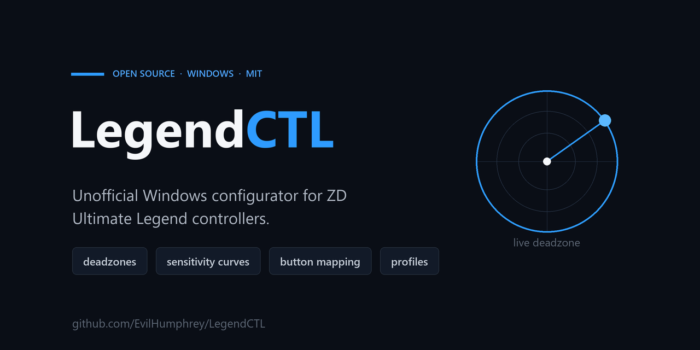
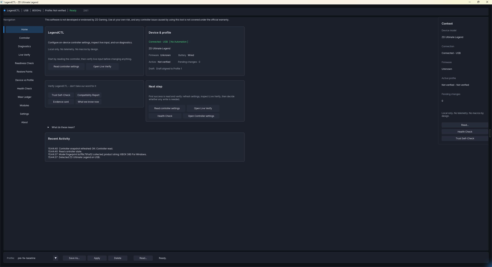
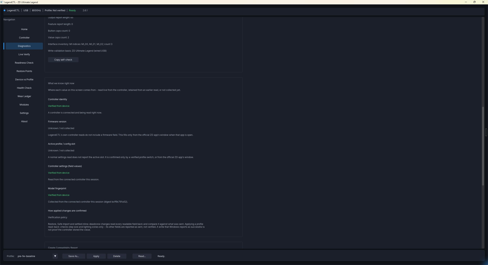
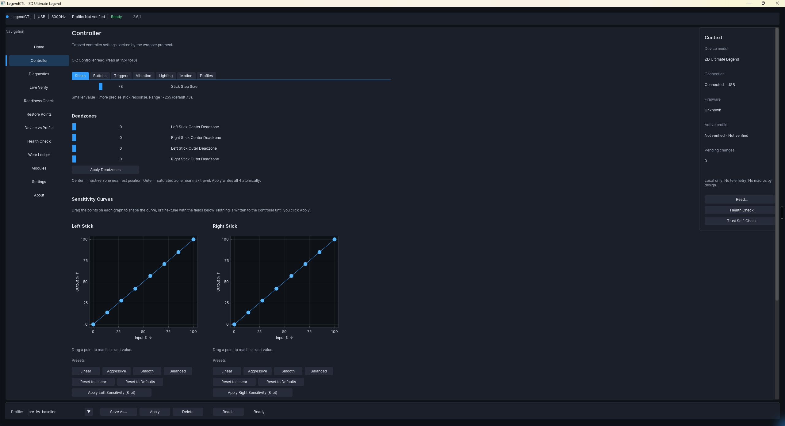
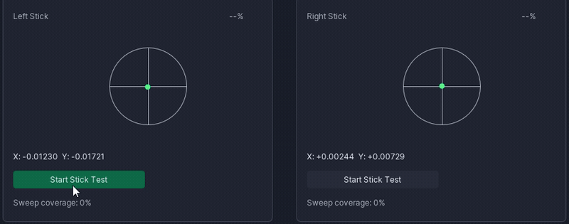

<p align="center">
  
</p>

# LegendCTL

*Unofficial Windows configurator for ZD Ultimate Legend controllers.*

[](https://github.com/EvilHumphrey/LegendCTL/releases/latest)
[](LICENSE)
[](https://github.com/EvilHumphrey/LegendCTL/actions/workflows/ci.yml)


LegendCTL is a free, open-source Windows app for reading and applying ZD Ultimate
Legend controller settings. It runs **standalone** — it talks directly to the
controller over USB-HID, so the official ZD app is **not required** to use it. It is
lightweight, fully local, and preserves your configuration across sessions. It
configures the controller's supported settings — it is not a firmware updater.
(Firmware updates use ZD's **separate** official firmware tool — not the config
app, and not LegendCTL.)

> **Independent third-party project. Not developed by, affiliated with, or
> endorsed by ZD Gaming.** "ZD Gaming" and "ZD Ultimate Legend" are used only
> to identify the controller this tool is compatible with; all trademarks are
> the property of their respective owners.

[**⬇ Download the latest release**](https://github.com/EvilHumphrey/LegendCTL/releases/latest) — Windows 10/11, portable ZIP or installer. First launch will likely show a SmartScreen prompt — [here's why, and how to verify your download](docs/install-windows-and-smartscreen.md).

## A look at it

<p align="center">
  
</p>

<p align="center">
  
  
</p>

**Live Verify** reads both sticks straight from XInput. Start a stick test and sweep — each stick's trace fills its circle, sweep-coverage climbs, and the per-stick circularity settles to a percentage, so you can see how round your sticks really are and catch a flat spot or off-center rest. Everything runs locally; no network, no telemetry.



## Why LegendCTL?

Whether or not you use the official ZD app, here's what this one gives you. The
short version is **trust you can verify**:

- **Open source, MIT-licensed.** Every line is on GitHub — read it, build it
  yourself, fork it. Nothing is hidden.
- **Fully local — no network, no telemetry.** The LegendCTL process makes
  **zero** network calls — no telemetry, no analytics, no auto-update. (The
  About and Compatibility Report GitHub buttons hand a URL to your browser; the
  app itself opens no socket.) You don't have to take any of that
  on faith: you can
  [confirm the no-network behavior yourself](docs/verifying-no-network.md) in a
  couple of minutes.
- **No drivers, no virtual devices, no background service.** Nothing installs a
  driver or sits running in the background. Close the app and no process or
  service of it is left running.
- **Honest write reporting.** A normal Apply reports each
  field's real write outcome and refreshes the on-screen state from the device;
  a profile Apply and the Restore, Safe Import, and inline deadzone flows go
  further and verify the readable fields they wrote by reading the values back
  — so a write that the device demonstrably didn't
  commit is surfaced honestly instead of flashing "success."
- **No macros, turbo, or automation.** It configures your controller; it never
  plays for you. That's a deliberate constraint enforced by tests, not a missing
  feature.
- **A safety net by default.** Device-touching changes — applying device
  settings, deadzone tuning — capture a **Restore Point** first where one can
  be taken, wrapper events are written to an append-only local ledger, and
  there are two [Recovery](#recovery--if-your-controller-feels-off) paths back.

That's the whole pitch: a small, auditable, no-surprises tool for your controller
— open where closed software is opaque, local by design, and honest about what it
can and can't do.

## Install

**Two ways to get it, both shipping the exact same wrapper executable** — the
portable ZIP is the simplest and needs no admin rights; the installer adds
Start-Menu/uninstaller integration. In the file names below, `<version>` is the
release number shown on the [latest release](https://github.com/EvilHumphrey/LegendCTL/releases/latest) page.

- **Portable ZIP (recommended).** Download `ZDUltimateLegend-v<version>-windows.zip`
  from the [latest release](https://github.com/EvilHumphrey/LegendCTL/releases/latest),
  extract anywhere, and run `ZD Ultimate Legend.exe`. No admin, no UAC prompt, no
  installer; uninstall by deleting the folder. Settings persist in
  `%APPDATA%\ZDUltimateLegend\` regardless of where the folder lives — so it runs
  from anywhere, including a thumb drive.
- **Installer.** Download `ZDUltimateLegend-v<version>-Setup.exe` from the same
  release. It installs to `%ProgramFiles%\ZDUltimateLegend\` (requires admin — a
  UAC prompt; installing under Program Files means only administrators can modify
  the app files), adds a Start Menu entry under "ZD Ultimate Legend Wrapper",
  registers an uninstaller in Windows Settings → Apps, and optionally adds a
  desktop shortcut (unchecked by default). The only difference from the ZIP is the
  install/uninstall machinery; the wrapper itself is identical.
- **winget (available) / Scoop (planned).** Install from the
  [Windows Package Manager community repository](https://github.com/microsoft/winget-pkgs/tree/master/manifests/e/EvilHumphrey/LegendCTL)
  with `winget install --id EvilHumphrey.LegendCTL --exact`. The community
  catalog can trail the newest GitHub release while an update is
  validated; `winget show --id EvilHumphrey.LegendCTL --exact` reports the
  version it currently carries. A Scoop bucket is still planned.

> **A note on names.** The project is named **LegendCTL**, but the application
> window, Start Menu entry, and executable still carry the legacy name *ZD
> Ultimate Legend Wrapper* / `ZD Ultimate Legend.exe` — it is the same program,
> and the download files keep those legacy names too.

### First-run SmartScreen, and verifying your download

Because the build is currently **unsigned** (no Authenticode certificate — see the
[code-signing policy](docs/code-signing-policy.md) for the SignPath Foundation plan),
a couple of things are expected and normal on first launch:

- **SmartScreen warning.** The first time you run it, Windows SmartScreen will
  likely show a "Windows protected your PC" / "unrecognized app" prompt.
  SmartScreen weighs code signing and download reputation, so the exact behavior
  can vary (and enterprise policy can change it) — the prompt is not in itself a
  sign of malware. If you trust the source and have verified the hash (below),
  choose **More info → Run anyway**.
- **Verify the published SHA-256.** Every release publishes `SHA256SUMS.txt`,
  which lists the hash of each downloadable artifact (the `-windows.zip` and the
  `-Setup.exe`). Confirm your download matches before extracting/running:

  ```powershell
  Get-FileHash ".\ZDUltimateLegend-v<version>-windows.zip" -Algorithm SHA256
  ```

  Compare the output against the matching value in `SHA256SUMS.txt`.
- **Antivirus false positives.** PyInstaller-packaged apps (this is one) are a
  well-known source of heuristic AV false-positives, because the self-extracting
  bundle pattern resembles some packers. If your AV flags the build, you can
  cross-check it on [virustotal.com](https://www.virustotal.com/) against many engines.

The full walkthrough, with screenshots, is in the
[Windows install guide](docs/install-windows-and-smartscreen.md).

## Disclaimer & risk

ZD Gaming asked that this project carry the following disclaimer, which it
reproduces verbatim:

> This software is not developed or endorsed by ZD Gaming. Use at your own risk, and any controller issue caused by using this tool is not covered under the official warranty.

Beyond that: LegendCTL is provided **"as is", without warranty of any kind**,
express or implied, to the maximum extent permitted by applicable law. You
assume all risk arising from its use. It writes settings to controller hardware
over USB/HID and reports each field's write outcome; profile Apply and the
Restore, Safe Import, and inline deadzone flows additionally verify readable
fields by read-back, while the write-only
back-paddle bindings are reported as sent. There is always a **Recovery** path
(see below), but you are responsible for how you use it.

See [SECURITY.md](.github/SECURITY.md) for the security posture,
[docs/verifying-no-network.md](docs/verifying-no-network.md) to confirm the
"no network" claim yourself, [NOTICE](NOTICE) for affiliation and third-party
license details, and the [code-signing policy](docs/code-signing-policy.md) for
how releases are (will be) signed.

## Quick start

1. Plug a ZD Ultimate Legend controller into a USB port.
2. Launch `ZD Ultimate Legend.exe` (Start Menu shortcut after an installer install,
   or by extracting the ZIP and double-clicking). On first launch you may see the
   [SmartScreen prompt](#first-run-smartscreen-and-verifying-your-download) — verify
   your download and trust the source first, then choose **More info → Run anyway**.
3. The app auto-reads current controller state on connect.
4. Adjust settings via the sidebar tabs; click Apply per-tab or in the footer to write.

## Features

Feature-complete for normal use.

Controller settings (all written as standard HID feature reports; a normal Apply
reports each field's write outcome, reads back and compares every readable field
it wrote — showing per-field matched / mismatched / could-not-verify results —
and refreshes the on-screen state from the device; the Restore, Safe Import, and
inline deadzone flows read back and verify the readable values they wrote the
same way — the write-only back-paddle bindings are reported as sent, not verified):

- USB polling rate (250–8000 Hz; 8K requires firmware v1.18+)
- 16×16 button binding matrix, with a Current Bindings display read from the
  controller
- Sticks: deadzones (4 zones), sensitivity curves (3-anchor, plus 8-point curves on
  firmware v1.24+), axis inversion, joystick step-size
- Triggers: range, mode, vibration mode
- Lighting: per-zone (Home / Left / Right) — on/off, mode, brightness, RGB
- Vibration: per-motor + trigger vibration mode
- Back-paddle bindings: 1-step controller-button-only (8 paddles: M1–M4, LM, RM, LK, RK);
  existing on-controller paddle mappings are not readable over USB, so LegendCTL
  says plainly when a value is "Not set in LegendCTL" instead of inventing one
- Wrapper profiles: save / apply / delete profile-scoped controller settings,
  with optional polling-rate and step-size capture

Controller lifecycle & trust surfaces:

- Restore Points: full-state capture before risky operations, per-entry verified
  restore, retention pruning
- Device vs Profile: read-only three-way diff (live device / saved profile /
  last-applied) with per-field drift highlighting
- Live controller visualizer: controls light as you press them, but it is honest
  that the live view reflects XInput output — not the physical source of a
  remapped input
- Health Report (guided multi-step measurement workflow, exportable) and Readiness
  Check (20-second pre-match verdict)
- Wear Ledger: append-only audit log of wrapper events
- Module Passport: per-side stick-module fingerprints with longitudinal trends
- Diagnostic Bundle: operator-triggered, path-sanitized shareable evidence export
- Trust card at first connect; English, Simplified Chinese, and Korean UI throughout
- Live Verify: live XInput stick + per-stick circularity readout, plus inline
  firmware-deadzone tuning — each deadzone change captures a Restore Point first,
  and its settled value is read back to confirm, with the panel saying so when the
  confirm read can't be completed

Deliberately absent (constraint architecture, enforced by tests): no drivers, no
virtual devices, no input injection, no macros/turbo/automation, no background
service, no network calls, no telemetry, no auto-update. See
[docs/ARCHITECTURE.md](docs/ARCHITECTURE.md). You can confirm the no-network
behavior yourself in a couple of minutes — see
[docs/verifying-no-network.md](docs/verifying-no-network.md).

Profile sharing ("Safe Import") exists in the codebase but is dev-gated and parked —
the Import button is hidden unless the Developer toggle is enabled.

## Will it work on my controller?

**If you have a ZD Ultimate Legend, the core settings very likely work.** The app
was developed and bench-tested on a **single ZD Ultimate Legend unit**, on the
firmware it ran — **known-working firmware: v1.18 (including 8K polling) and v1.24
(including the 8-point sensitivity curves), verified through the latest v1.24 "0609"
optimized-latency build.**

The ZD Ultimate Legend ships in **six controller variants** with different stick
modules and firmware revisions. Other firmware versions, the other variants, and
different stick modules are **best-effort**: the HID protocol this app relies on
may differ, so some settings may read or write differently — or not at all — on
hardware that wasn't on the bench. The important part is that the app is built to
**report unsupported paths and write-only fields explicitly rather than pretend a
write succeeded** — and there is always the [Recovery](#recovery--if-your-controller-feels-off)
path if something looks off. If a setting misbehaves on your unit, please
[report it](.github/SUPPORT.md) with the requested signature data and logs.

See the maintained [compatibility matrix](docs/compatibility-matrix.md) for the
current evidence ledger and the status taxonomy used for community reports.

## Recovery — if your controller feels off

If the controller starts behaving oddly after changing settings (whether with
this tool or any other), there is always a clear way back:

1. **Official ZD app → "Restore to default".** Open the official ZD Gaming app,
   use its *Restore to default* function, then re-apply your preferred settings.
   This is the vendor's own known-good reset and the most reliable recovery path.
2. **Wrapper Restore Points.** Before risky operations this app attempts to
   capture a Restore Point — a snapshot of the app-readable settings. Open **Restore
   Points** in the sidebar and restore an earlier one to roll back the settings
   this app can write. Restore Points cover app-supported, app-readable settings
   (they are not a full firmware/factory backup); each point states exactly what
   it captured.

Between the vendor's "Restore to default" and the wrapper's Restore Points, you
have two recovery paths back.

## Getting help

Start with the **[FAQ](docs/FAQ.md)** — it answers the common questions (is it
safe? do I need the official app? why the SmartScreen warning? does it phone
home? will it work on my controller?).

Bug reports and questions are welcome through GitHub. Please read
[SUPPORT.md](.github/SUPPORT.md) first — it explains what belongs in an **Issue** (a
reproducible bug, filed with the data the bug-report form asks for) versus a
**Discussion** (questions and general help), and what this best-effort hobby
project can and cannot support. There is no private DM or email support
channel; reports for untested hardware need the requested signature data and
logs attached or they will be closed.

## Build from source

Requires **64-bit Python 3.12** (the version the project is developed and
tested against day-to-day; official release binaries since v2.5.0 are built by
CI on Python 3.13, with the full suite run on both — see
[docs/code-signing-policy.md](docs/code-signing-policy.md)). The pinned
`dearpygui==2.3.1` ships prebuilt wheels only for specific
Python versions and architectures, so other interpreters may need to compile it
from source.

```powershell
python -m venv .venv-zd
.venv-zd\Scripts\pip install -r requirements.txt
.venv-zd\Scripts\pythonw main_zd.py
```

`pythonw` (no console window) is preferred over `python` for normal use. If the
window doesn't appear, re-run with `python` to see startup errors in the console.

**Build a release:**

```powershell
.\tools\setup_dev_env.ps1
.\tools\build_release.ps1
.\tools\smoke_release.ps1 -DurationSeconds 5
```

The release setup downloads the reviewed Python closure once, verifies every
wheel against `requirements-release.lock`, then installs the build environment
offline. `build_release.ps1` refuses an unproven venv and does not resolve or
install packages itself. See [the release dependency lock](docs/release-dependency-lock.md)
for the refresh procedure and the separate Inno Setup/Chocolatey residual.

Output: `dist/ZDUltimateLegend-v<version>/ZD Ultimate Legend.exe` plus a
distributable ZIP. If [Inno Setup 6](https://jrsoftware.org/isdl.php) is installed
(`C:\Program Files (x86)\Inno Setup 6\ISCC.exe`), an installer `.exe` is produced
too; the build falls back to ZIP-only when Inno isn't present.

**Run the test suite:**

```powershell
.venv-zd\Scripts\python -m unittest discover tests -p "test_*.py"
```

## Architecture

Full technical architecture: [docs/ARCHITECTURE.md](docs/ARCHITECTURE.md). Short map:

- `zd_app/protocol/` — stable HID protocol layer (interface enumeration, two-handle
  session helpers, preflight checks). Production code; shipped in the dist.
- `zd_app/services/` — business logic, zero UI imports: settings transport + apply
  coordinator (per-field write outcomes, firmware-quirk trailers, a post-apply read-back
  sweep over every readable written field, best-effort verify/retry setters for step
  size and lighting zones), restore points, snapshot differ, health
  report, wear ledger, module passport, diagnostic bundle.
- `zd_app/storage/` — JSON/JSONL stores with atomic writes: wrapper profiles, app
  settings, restore points, last-applied record, snapshot codec.
- `zd_app/ui/` — Dear PyGui screens + the AppShell coordinator, including the
  threaded HID-job seam (long device flows run off the render thread) and the
  modal-swap seam (encodes DearPyGui's modal-rendering law).
- `zd_app/i18n/` — locale loader + `en.json` / `zh-CN.json` / `ko.json` (full parity gate).
- The shipped application imports nothing outside `zd_app/`, `main_zd.py`, and the
  build tools — a boundary enforced by tests.

## License

Project license: MIT (c) 2026 EvilHumphrey; see the repository `LICENSE` file
for the full text. Bundled third-party components retain their original
licenses; see **About → Licenses** in the running app for full text. License
files also live under `assets/licenses/`.

## Acknowledgments

LegendCTL was built with substantial AI assistance, under human direction and
review throughout. Much of the reverse-engineering, implementation, test-writing,
and adversarial code review was done by AI agents — with all changes
human-reviewed, hardware-facing changes tested on the documented real controller
where applicable, and every release shipped by the maintainer.

- **Claude** (Anthropic) — primary development, reverse-engineering research, and
  code review, via Claude Code.
- **Codex / GPT-5.6** (OpenAI) — implementation lanes, independent
  second-perspective review, and adversarial release gates.
- **GPT-5.6 / GPT-5.5 (via Hermes)** — cross-model review, localization, and strategy.

This project's posture is honesty by design, so it says that plainly.

## Historical: lineage

LegendCTL began as a controller-input latency-analysis tool; that earlier
code is a separate project and is not part of this repository. The wrapper is a
ground-up tool for the ZD Ultimate Legend specifically.
