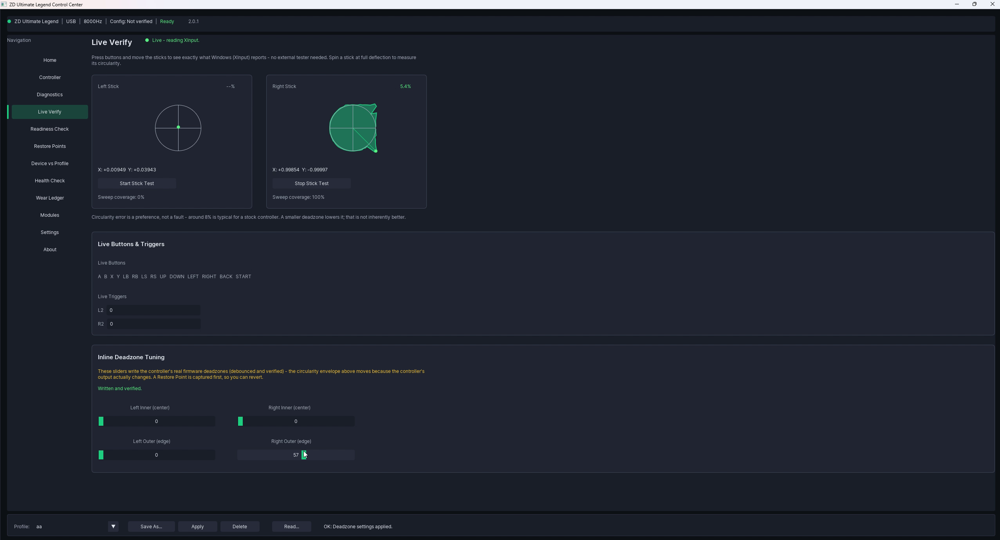
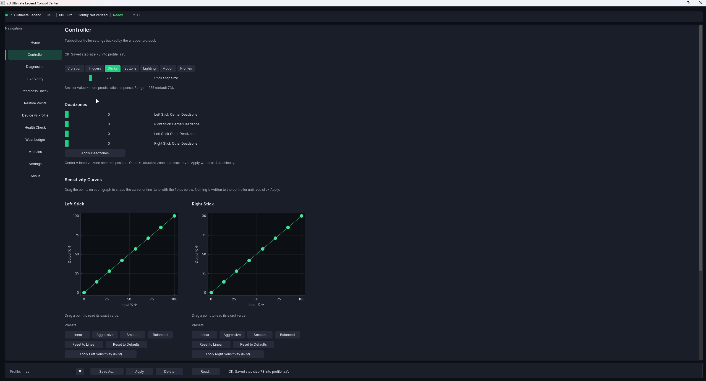
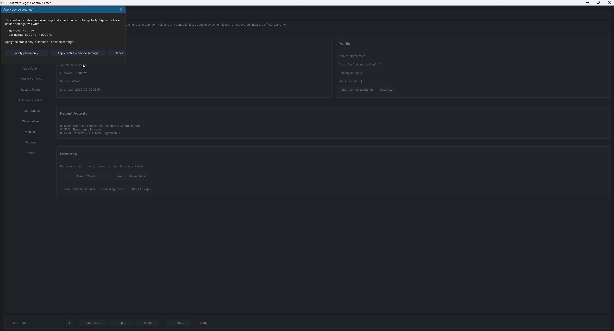

# LegendCTL — Reviewer / Tester Kit

A one-stop kit for anyone evaluating, testing, or writing about LegendCTL. The
ask is simple: **try it honestly and say what you actually find** — a candid
take is far more useful than a kind one. Everything below is fair game to quote,
screenshot, or record (MIT-licensed).

## What it is, in one line

A free, open-source, fully-local Windows configurator for the **ZD Ultimate
Legend** controller — open, auditable, and no-telemetry, for the settings it
supports. It runs standalone (the official ZD app isn't required) and coexists
with it.

## The 30-second pitch

LegendCTL reads and writes ZD Ultimate Legend controller settings (deadzones,
sensitivity curves, polling rate, button mapping, triggers, lighting, vibration,
paddles) over standard USB-HID. What makes it worth a look isn't any single
feature — gamepad testers and config apps exist — it's the **posture**:

- **Open source (MIT)** — every line is on GitHub; build it yourself.
- **Fully local** — the process makes zero network calls (no telemetry, no
  analytics, no auto-update). You can prove it in two minutes (below).
- **Honest writes** — it reports the real outcome of each write and reads values
  back on the verifying paths, instead of flashing "success" and hoping.
- **Standalone** — talks straight to the controller; the official ZD app isn't
  required (it coexists if you keep it).
- **A safety net** — Restore Points before risky changes, an append-only local
  event ledger, and a clear Recovery path.
- **Honest about its limits** — bench-tested on a single unit; it says so, and
  tells you when a setting isn't verified on your hardware rather than faking it.

It is **not** a macro/turbo tool, not a virtual-controller driver, and not a
firmware updater — those are deliberately absent.

## Get it (≈2 minutes)

Portable ZIP is the low-friction path — no admin, no installer:

1. Download `ZDUltimateLegend-v<version>-windows.zip` from the
   [latest release](https://github.com/EvilHumphrey/LegendCTL/releases/latest).
2. The build is currently **unsigned**, so the first run shows Windows SmartScreen
   ("Windows protected your PC"). That's expected for any new unsigned app — if
   you like, verify the **SHA-256** against `SHA256SUMS.txt` in the release first,
   then **More info → Run anyway**.
3. Extract anywhere and run `ZD Ultimate Legend.exe` (the window/exe still carry
   the project's legacy name — same program).

You'll need a ZD Ultimate Legend plugged in via USB to exercise the device
features; the UI and Live Verify open without one.

## A suggested 5-minute test path

1. **Plug in & connect.** The app auto-reads the controller's current state.
2. **Live Verify.** Open it and sweep both sticks — each stick's trace fills its
   circle and the per-stick **circularity** settles to a percentage. Then drag a
   **deadzone** inline and watch the envelope respond live (this deadzone-tied
   circularity is the part web testers can't do — they can't touch your hardware).
3. **Change a setting and watch the write.** Adjust e.g. a deadzone or sensitivity
   and Apply — note that it reports the actual per-field outcome and refreshes
   from the device.
4. **See the safety net.** Open **Restore Points** — note that risky changes
   capture one automatically; restore an earlier one to roll back.
5. **Prove "no network" (optional, the fun part).** Follow
   [docs/verifying-no-network.md](verifying-no-network.md) — watch Resource Monitor
   show zero connections while the app runs and writes.

## What's genuinely differentiated (and what isn't)

- **Commodity:** a stick/circularity *tester*. Plenty of free web tools do that.
  It's a nice gateway, but it's not the reason to pick LegendCTL.
- **Differentiated:** an **open, local, no-telemetry, auditable** configurator
  that **verifies its writes** and is **honest about untested hardware**. The
  deadzone-tied live circularity is the most camera-friendly demo of that.

For context (a category pattern, not a swipe at any one app): closed controller
and peripheral software commonly bundles telemetry and analytics SDKs.
LegendCTL's pitch is the inverse, and it's verifiable rather than asserted.

## Honest caveats (please mention these)

- **One unit, bench-tested.** Developed/verified on a single ZD Ultimate Legend
  (firmware v1.18 incl. 8K, v1.24 incl. 8-point sensitivity). The controller ships
  in six variants; other variants/firmware are best-effort.
- **Unsigned** today (SmartScreen warning expected; signing is planned via the
  SignPath Foundation OSS program once eligible).
- **AI-assisted**, human-directed and reviewed — disclosed in the
  [Acknowledgments](../README.md#acknowledgments); the code is open and
  test-enforced so the claims are checkable.
- **Solo, best-effort hobby project** — no support contract; see
  [SUPPORT.md](../SUPPORT.md).

## Assets

- **Demo GIF** (in-repo): [docs/media/legendctl-liveverify-demo.gif](media/legendctl-liveverify-demo.gif)
- **Screenshots:**
  - Live Verify circularity sweep — 
  - Sensitivity-curve editor — 
  - Overview / Home — 
- More screens (dual-stick Live Verify, controller settings, diagnostics) are in
  [docs/media/](media/). Need a specific shot, a higher-res capture, or a short
  clip of a particular flow? Open a Discussion or email and it's easy to provide.

## What feedback is most useful

Candid, not flattering. Especially: did the **download → SmartScreen → first run**
path feel safe and clear? Did writes behave as reported on your unit? Anything
confusing in the first 60 seconds? Anything that felt untrustworthy? Bugs and
"this didn't work on my controller" reports are genuinely welcome —
[file them here](https://github.com/EvilHumphrey/LegendCTL/issues/new/choose).

## Coverage notes

No endorsement is requested or implied — please test independently and say what
you find. If you do cover it, a link to the repo
(`https://github.com/EvilHumphrey/LegendCTL`) is appreciated so people can read
the source and verify the claims themselves. Everything here is MIT-licensed and
free to use.
