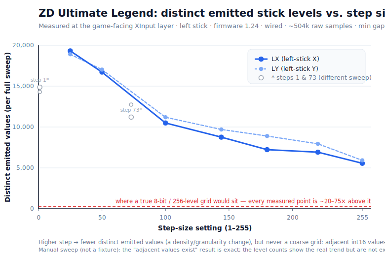

# What ZD's "step size" actually does to your stick output — measured

**TL;DR.** We measured the ZD Ultimate Legend's actual stick output (at the game-facing XInput layer) across nine "step size" settings from 1 to 255. The popular belief that a high step *quantizes* the stick to a coarse, low-bit grid — or that 255 is "8-bit / near-binary" — **is not what the data shows.** Even at step 255 the controller still emits *adjacent* raw values and **thousands** of distinct output levels, nowhere near 256. What step size actually does is **thin the number of distinct emitted values** (fewer distinct outputs as step rises) — a density/granularity change, not a bit-depth cut.

> **Status:** first measurement (2026-07-01). The "no coarse grid" result is robust; the exact distinct-value *counts* are a directional trend (see caveats). We may refine this with further captures.

## What we measured
Left stick · firmware 1.24 · wired USB · no deadzones · linear curve. For each step value we set it in LegendCTL and confirmed the readback, then logged the raw 16-bit XInput axis values (`sThumbLX`/`sThumbLY` — exactly what a game sees, with no deadzone or smoothing applied) at ~1000 Hz through two slow 25-second full-range sweeps. **~504,000 samples** total across 9 step values × 2 runs.

## What we found
1. **No coarse grid — at any step.** The minimum gap between adjacent distinct emitted values stayed at **1** for every step, including 255. If step size were quantizing the output to a coarse grid, you'd see large gaps and missing intermediate values at high step. You don't. (An 8-bit / 256-level grid is drawn on the chart for reference — every measured point towers ~20–75× above it.)
2. **A real density trend.** The count of *distinct* emitted values falls steadily as step rises — roughly **19,000 distinct levels at step 25 down to ~5,600 at step 255** (about 3.4× fewer). So higher step = fewer distinct outputs = a coarser feel, achieved by thinning density, not by chopping bit-depth. Left-X and left-Y track together.

## What this means in practice
- **Lower step** = the finest, "livelier" output. Per owner reports it can also feel *shakier*, because it passes more of the stick's natural jitter through.
- **Higher step** = fewer distinct outputs = a smoother / coarser feel.
- **"Step 255 = 8-bit / binary in-game" is a myth** — measured, 255 still emits thousands of distinct values.

## Honest caveats
- **First measurement, may be refined.** We may repeat this with a motorized fixture; treat the exact distinct-level counts as a *directional trend* rather than exact output-grid cardinalities (they depend on sweep speed and dwell). The "adjacent values always exist" result is exact.
- Manual sweep (no motorized fixture); at-rest windows contaminated by unavoidable stick motion are flagged and excluded in the analysis.
- Steps 1 and 73 were captured with a slightly different sweep motion than 25–255, so they're shown as separate markers (not on the trend line).
- This measures the game-facing **XInput layer only** — not the internal TMR sensor resolution or private firmware math.

## Verify it yourself
Nothing here is meant to be taken on faith. Published alongside this note in [`what-step-size-does/`](what-step-size-does/):

- **`step_capture.py`** — the raw XInput logger (standalone; only calls `XInputGetState`, no device writes).
- **`analyze.py`** — the analysis (distinct-level counts, min-gap, gap histograms).
- **`analysis_summary.md`** — the full per-run results for all 9 steps × 2 runs.
- **`step_density_curve.svg`** — the chart above.

The raw per-sample CSVs (~29 MB, ~504k samples) are available on request. Data captured 2026-07-01 with **LegendCTL** — an independent, local, no-telemetry configurator for the ZD Ultimate Legend.
