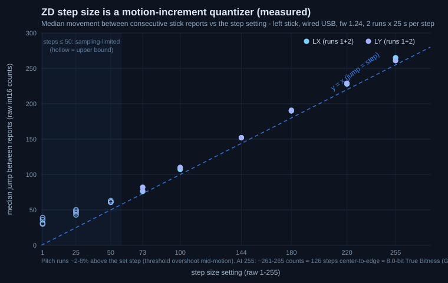

# What ZD's "step size" actually does to your stick output — measured (corrected)

**TL;DR.** We measured the ZD Ultimate Legend's stick output at the game-facing XInput layer across nine "step size" settings from 1 to 255. **Step size is a motion-increment quantizer:** the stick reports a new position only after moving at least ~step raw units (of 65,535 full-scale) from the last position it reported. The measured movement between reports equals the step setting within a few percent at every step we can resolve. That makes the community's "255 ≈ 8-bit" intuition **right in practice** — running GamepadLA's own StickAnalyzer algorithm on the device at step 255 reports **127 steps-from-center / 7.99 True Bitness, in both runs, identically** — with one refinement: it's a *relative* grid (anchored to the last reported value), not a fixed 256-point lattice.

> **Correction notice (2026-07-01).** The first version of this page concluded step size was "a density knob, not a grid," based on pooled distinct-value counts and minimum gaps. A skeptical second pass — prompted by how consistently the community holds the "255 ≈ 8-bit" view — re-analyzed the same capture adversarially and showed those metrics are the wrong ones for a *relative* quantizer. The community was right; our first framing was wrong. This page is the corrected analysis, since confirmed four independent ways, and the superseded metrics are explained below so you can reproduce both and see the difference yourself.

## What we measured

Left stick · firmware 1.24 · wired USB · no deadzones · linear curve. For each step value we set it in LegendCTL and confirmed the readback with a device read, then logged the raw 16-bit XInput axis values (`sThumbLX`/`sThumbLY` — exactly what a game sees, with no deadzone or smoothing applied) at ~1000 Hz. Two protocols: two slow 25-second full-range sweeps per step (~504,000 samples across 9 step values × 2 runs), plus a slow one-way center→edge sweep per step implementing GamepadLA's published StickAnalyzer measurement (monotonic dead-band, SFC = 1/mean-gap).

## What we found: a motion-increment quantizer

**The stick reports a new position only after moving at least ~step raw units from the last position it reported.** That's the whole mechanism, and it's visible directly in the data: the median movement between consecutive stick reports ("pitch") equals the step setting, within a few percent — and the on-device StickAnalyzer-algorithm run confirms the resulting resolution:

| step setting | measured jump between reports | measured SFC / True Bitness* |
|---:|---:|---:|
| 1 | (noise floor) | 858–1055 / **10.7–11.0** — the stick's native ceiling |
| 25 | 30 | 928–986 / 10.9 |
| 73 (default) | 76–82 | 517–541 / 10.0 |
| 100 | 107–110 | (~300 / ~9.2, interpolated) |
| 144 | 152–153 | 250–251 / 8.97 |
| 180 | 190 | (~172 / ~8.4, interpolated) |
| 220 | 228 | (~144 / ~8.2, interpolated) |
| 255 | 260–265 | **127 / 7.99** (both runs, identically) |

\* SFC ("steps from center") and True Bitness = log2(2 × SFC) per GamepadLA's convention — measured by re-running their published StickAnalyzer algorithm (slow one-way center→edge sweep, monotonic dead-band, SFC = 1/mean-gap) on the device at each confirmed step setting; interpolated rows come from the measured jump sizes. Two details: at mid steps the measured SFC runs ~15% finer than jump-size alone predicts (occasional small catch-up reports survive the dead-band), and settings at or below the stick's own noise floor (~step 25 and down) converge on the same ~11-bit ceiling — **step 1 buys nothing measurable over step 25.**

The jump sizes are extremely tight per step (spread ~6–13% of the median) while the *durations* between reports vary widely with sweep speed — the signature of an increment threshold, not of a rate limiter. The poll cadence itself stays at 1.000 ms at every step: the mechanism is purely value-domain.

## So is "255 = 8-bit" right?

**In practice, yes — with one refinement.** At step 255 any single stick motion moves in ~257-count chunks: ~127 distinct positions from center to edge, which is 8-bit-equivalent granularity in the metric the community already uses. The refinement: it's a *relative* grid, anchored to the last reported value, not a fixed 256-point lattice. Successive passes over the range land at offset positions.

## Where the first analysis went wrong

Our first pass pooled all distinct values across a whole sweep and checked the minimum gap between them. On a relative grid those metrics mislead: each pass re-anchors, so the union of passes fills the range in (we saw ~5,600 pooled distinct values at step 255, with adjacent-value gaps of 1) — and we wrongly concluded "no quantization." Pooled counts and min-gaps measure the union of many offset grids; **the movement between consecutive reports is the right metric for a relative quantizer,** and it reads ≈ the step setting. Both analyses are published below — run them side by side.

## Independent cross-checks

Four legs, independently:

1. **Two sweep protocols** on the same device agree (the 1 kHz full-range sweeps and the StickAnalyzer-style one-way sweeps).
2. **A blind re-analysis of the raw CSVs by an independent analyst** — given no access to our conclusions — derived the same mechanism, with a functional fit `jump ≈ √((1.03·step)² + 34²)` at R² = 0.999 across all nine steps.
3. **GamepadLA's published ZD Ultimate Legend test** (independent rig, wired XInput, stock settings) measured Step Resolution 0.00226 — that's **74 raw counts per step, i.e. the factory-default step size (73) showing up on an independent tool**, matching our step-73 jump measurement (76–82). Their 443 SFC / 9.8-bit figures line up with the same rule (our fw-1.24 unit measures 517–541 / ~10.0 at step 73 — same ballpark; firmware and unit differences apply).
4. **GamepadLA's own algorithm, re-run on the device at each step:** at 255 it reports **0.0078 step resolution / 127 SFC / 7.99 True Bitness — in both runs, identically.** Anyone with the controller and their tool can reproduce this.

## What it means for feel and settings

- **Step 1** = passes the sensor's own noise straight through (why very low steps feel alive/twitchy) — and it buys nothing measurable over ~25: settings at or below the stick's noise floor converge on the same ~11-bit ceiling.
- **Default 73** = the vendor's noise-vs-precision compromise (~74–82-count granularity, ~9.8–10-bit).
- **Higher steps** = progressively chunkier motion; **255 ≈ 8-bit-like coarseness**. Because a report requires crossing the increment, higher steps also *reduce the effective update rate* during motion (fewer, bigger steps per second) — consistent with owner reports that step affects report rate.
- Practical rule: run the lowest step that's stable for your stick; raise it only enough to calm jitter.

Unrelated but often conflated: "I set 255 and it didn't stick" in the official app is a separate write-reliability quirk (the firmware silently drops some setting writes; LegendCTL verifies every write and retries until the controller confirms).

## Honest scope

Manual sweeps (not a motorized fixture); XInput/game-facing layer (not the internal sensor); a secondary population of small catch-up reports exists near direction changes (it nudges mid-step SFC ~15% finer than jump-size alone predicts) — none of which changes the headline. Raw data and every script are published; verify it yourself.

## Verify it yourself

Nothing here is meant to be taken on faith. Published alongside this note in [`what-step-size-does/`](what-step-size-does/):

- **`step_capture.py`** — the raw XInput logger (standalone; only calls `XInputGetState`, no device writes).
- **`reanalyze_2026-07-01.py`** — the corrected analysis (plateau segmentation, per-step pitch, jump histograms) and its output **`reanalysis_2026-07-01.json`**.
- **`discriminate_model_2026-07-01.py`** — the increment-vs-rate-limiter discrimination and its output **`discrimination_2026-07-01.json`**.
- **`stickanalyzer_equiv_capture.py`** — the on-device implementation of GamepadLA's StickAnalyzer measurement and its results **`stickanalyzer_equiv_RESULTS_2026-07-01.json`** (the SFC / True Bitness table above).
- **`analyze.py`** + **`analysis_summary.md`** — the *original, superseded* analysis and its per-run results, kept so you can reproduce exactly how the misleading metrics looked and why.
- **`step_increment_curve.svg`** — the chart above (measured pitch vs. set step, y = x reference).

The raw per-sample CSVs (~37 MB across both protocols) are available on request. Data captured 2026-07-01 with **LegendCTL** — an independent, local, no-telemetry configurator for the ZD Ultimate Legend.

---

*Revision history: v1 (2026-07-01) concluded "density change, not a grid" from pooled distinct-value counts; corrected the same day after an adversarial re-analysis of the same capture, then confirmed by a blind independent re-analysis and an on-device re-run of GamepadLA's algorithm (this page).*
